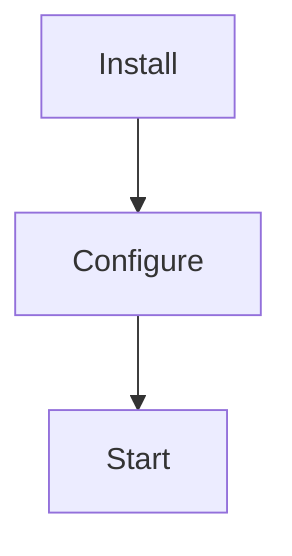

# Accessibility - MCP Skills Server

## Overview

This document defines accessibility requirements for the MCP Skills Server command-line tool and documentation.

**Target**: Ensure all users, including those using assistive technologies, can install, configure, and use the MCP Skills Server effectively.

---

## Accessibility Context

### Product Type: Command-Line Tool

- **No graphical UI** in MVP/v1.0
- Accessibility focuses on:
  - Documentation (web-based markdown)
  - CLI output (terminal text)
  - Error messages (screen reader friendly)
  - Terminal compatibility
  - Keyboard-only access (CLI is keyboard-only by nature)

### Accessibility Standards

**Target Compliance**: WCAG 2.1 Level AA for documentation and CLI output considerations

**Not Applicable**:
- Visual UI guidelines (no GUI)
- Mouse interaction (CLI is keyboard-only)
- Color contrast for UI elements (CLI uses terminal colors)

**Applicable**:
- Documentation accessibility
- Text readability and clarity
- Screen reader compatibility
- Terminal compatibility
- Clear error messages

---

## 1. Documentation Accessibility

### 1.1 Markdown Documentation (GitHub, Website)

**Requirements**:

✅ **Semantic HTML** (when rendered):
- Use proper heading hierarchy (H1 → H2 → H3)
- Use semantic elements (`<nav>`, `<main>`, `<article>`)
- Avoid skipping heading levels

✅ **Alt Text for Images**:
- All images have descriptive alt text
- Diagrams have text descriptions
- Screenshots have captions explaining content

✅ **Link Text**:
- Link text is descriptive (not "click here")
- Example: "Read the OAuth setup guide" (not "Click here for setup")

✅ **Code Examples**:
- Code blocks labeled with language
- Code examples have explanatory text before/after
- Terminal commands have context

✅ **Tables**:
- Tables have header rows (`<th>`)
- Complex tables have captions
- Table data is understandable by screen readers

✅ **Language Declaration**:
- English language declared in HTML (`lang="en"`)
- Consistent terminology throughout docs

### 1.2 README Accessibility

**Structure**:
```markdown
# MCP Skills Server

## Overview
[Brief description]

## Quick Start
[Installation steps]

## Configuration
[Setup guide]

## Troubleshooting
[Common issues]

## Documentation
[Links to full docs]
```

**Best Practices**:
- Headings create clear hierarchy
- Lists for sequential steps
- Code blocks for commands
- Clear section navigation

### 1.3 GitHub Issues & Pull Requests

**Templates**:
- Issue templates provide structure
- Clear labels for categorization
- Accessible markdown formatting

---

## 2. CLI Output Accessibility

### 2.1 Screen Reader Considerations

**Text-Based Output Only**:
- CLI output is plain text (inherently screen reader accessible)
- No visual-only indicators (use text labels)
- No ASCII art or box drawing (optional/disabled by default)

**Progress Indicators**:
```bash
# ✓ Good (text-based):
Discovering skills... (3/10) 30%

# ✗ Bad (visual-only):
[====              ] 30%
```

**Status Indicators**:
```bash
# ✓ Good (explicit text):
✓ OAuth configured successfully
✗ Skills directory not found

# ✗ Bad (symbols only):
✓ OAuth
✗ Skills
```

### 2.2 Color Usage

**Guideline**: Do not rely on color alone to convey information

**Good Practices**:
```bash
# Use text + color:
[ERROR] Configuration invalid    # Red text
[WARNING] Skill skipped           # Yellow text
[INFO] Server ready               # Green text

# Not just color without labels:
Configuration invalid    # Red only - not accessible
```

**Terminal Color Support**:
- Detect terminal capabilities
- Gracefully degrade if colors not supported
- Provide `--no-color` flag to disable colors

### 2.3 Log Format Readability

**Format**:
```
[TIMESTAMP] [LEVEL] [COMPONENT] Clear message text
```

**Rationale**:
- Structured format is screen reader friendly
- Each element clearly labeled
- Can be parsed by assistive tools

**Example**:
```
[2025-12-26 16:30:45] [INFO] [server] Server ready
```

Screen reader reads:
> "Two thousand twenty-five, twelve, twenty-six, sixteen thirty forty-five. Info. Server. Server ready."

---

## 3. Error Message Accessibility

### 3.1 Clear and Descriptive

**Requirements**:
- Error code + description
- Explanation of problem
- Specific fix steps
- No jargon or abbreviations

**Good Example**:
```
[ERROR] ERR_CONFIG_001: Skills directory not found

The configured skills directory does not exist:
  Path: ./dev-swarms/skills

To fix this issue:
1. Check that the path is correct
2. Create the directory: mkdir -p ./dev-swarms/skills
3. Or specify a different path: --skills-dir /path/to/skills
```

**Screen Reader Friendly**:
- Error code read aloud clearly
- Problem explained in plain language
- Steps numbered for clarity
- File paths read as text

### 3.2 Avoid Visual-Only Indicators

**Don't Use**:
- ONLY colors to indicate error severity
- ONLY icons without text labels
- Box drawing characters as primary information

**Do Use**:
- Text labels: `[ERROR]`, `[WARNING]`, `[INFO]`
- Explicit severity in message
- Numbered steps

---

## 4. Terminal Compatibility

### 4.1 Terminal Emulator Support

**Supported Terminals**:
- **macOS**: Terminal.app, iTerm2
- **Linux**: GNOME Terminal, Konsole, xterm
- **Windows**: Command Prompt, PowerShell, Windows Terminal
- **SSH/Remote**: Works over SSH connections

**Requirements**:
- Text-based output works in all terminals
- Colors optional (graceful degradation)
- No terminal-specific features required

### 4.2 Screen Size Flexibility

**Guidelines**:
- Assume minimum 80 characters width
- Wrap text appropriately
- Don't require wide terminal (120+ chars)
- Critical info fits in 80 chars

**Example**:
```bash
# Good (80 chars max):
[ERROR] ERR_CONFIG_001: Skills directory not found
Path: ./dev-swarms/skills

# Bad (requires wide terminal):
[ERROR] ERR_CONFIG_001: The configured skills directory does not exist: /very/long/path/to/dev-swarms/skills [Fix: check path]
```

### 4.3 Character Encoding

**Requirement**: UTF-8 support

- UTF-8 text output
- Handles international characters
- Emoji support (but not required for understanding)
- Fallback for terminals without Unicode

---

## 5. Keyboard Accessibility

### 5.1 CLI is Keyboard-Only

**Nature of CLI**:
- CLI tools are inherently keyboard-only
- No mouse required
- Accessible by design for keyboard users

### 5.2 Keyboard Shortcuts

**Standard Shortcuts** (Unix conventions):
- `Ctrl+C`: Interrupt/stop server
- `Ctrl+D`: EOF (end of input)
- `Ctrl+Z`: Suspend process
- `Ctrl+\`: Force quit

**Documentation**:
- Document keyboard controls
- Explain signals (SIGINT, SIGTERM)

---

## 6. Documentation Best Practices

### 6.1 Writing Style

**Guidelines**:
- Use clear, simple language
- Avoid jargon (or explain it)
- Active voice preferred
- Short sentences and paragraphs
- Headings every 2-3 paragraphs

**Examples**:

✅ **Good**:
> "Install the server using uv. Run `uv pip install mcp-skills-server`."

✗ **Bad**:
> "Utilize the uv package manager to facilitate installation of the aforementioned server package."

### 6.2 Step-by-Step Instructions

**Format**:
1. Numbered steps
2. One action per step
3. Expected outcome after each step
4. Clear success criteria

**Example**:
```markdown
## Installation

1. Install Python 3.8 or later
   - Verify: `python --version` shows 3.8+

2. Install uv package manager
   - macOS: `brew install uv`
   - Linux: `curl -sSf https://sh.uv.dev | sh`

3. Install MCP Skills Server
   - Run: `uv pip install mcp-skills-server`
   - Verify: `mcp-skills-server --version`
```

### 6.3 Visual Content Alternatives

**Images**:
- Always include alt text
- Provide text description in caption or nearby
- Don't rely solely on image to convey info

**Diagrams**:
- Use Mermaid (text-based diagrams)
- Provide text summary of diagram
- Include legend/key

**Example**:
```markdown
### Flow Diagram

The following diagram shows the setup flow:



**Text Summary**: The setup process has three steps: Install dependencies, configure OAuth, and start the server.
```

---

## 7. Accessibility Checklist

### Documentation Checklist

✅ **Content**:
- [ ] Heading hierarchy is logical (H1 → H2 → H3)
- [ ] All images have alt text
- [ ] Links have descriptive text
- [ ] Code examples have context
- [ ] Tables have headers
- [ ] Language declared (`lang="en"`)

✅ **Readability**:
- [ ] Clear, simple language
- [ ] Short sentences and paragraphs
- [ ] Jargon explained
- [ ] Active voice used

✅ **Navigation**:
- [ ] Table of contents for long pages
- [ ] Skip navigation links (for web docs)
- [ ] Breadcrumbs for hierarchical docs
- [ ] Search functionality (for web docs)

### CLI Output Checklist

✅ **Screen Reader Friendly**:
- [ ] Text-based output (not visual-only)
- [ ] Status indicators use text labels
- [ ] No reliance on color alone
- [ ] Clear, descriptive messages

✅ **Terminal Compatibility**:
- [ ] Works in 80-char width terminals
- [ ] Text wraps appropriately
- [ ] UTF-8 encoding supported
- [ ] Colors are optional (graceful degradation)

✅ **Error Messages**:
- [ ] Error code + description
- [ ] Explanation in plain language
- [ ] Specific fix steps numbered
- [ ] No jargon or abbreviations

---

## 8. Testing Accessibility

### 8.1 Screen Reader Testing

**Tools**:
- **macOS**: VoiceOver
- **Linux**: Orca
- **Windows**: NVDA, JAWS

**Test Scenarios**:
1. Read documentation with screen reader
2. Navigate docs using headings
3. Listen to CLI output
4. Verify error messages are understandable

**Success Criteria**:
- Documentation navigable by headings
- All content accessible without visual cues
- CLI output understandable when read aloud
- Error messages clear and actionable

### 8.2 Terminal Testing

**Test Environments**:
- Narrow terminal (80 chars)
- No color support terminal
- SSH connection (remote)
- Windows Command Prompt

**Success Criteria**:
- Output readable in all terminals
- No visual corruption
- Critical info visible without colors
- Text wraps appropriately

### 8.3 Documentation Testing

**Tools**:
- axe DevTools (browser extension)
- WAVE (Web Accessibility Evaluation Tool)
- Lighthouse (Chrome DevTools)

**Success Criteria**:
- No critical accessibility errors
- Heading hierarchy correct
- Alt text present and meaningful
- Color contrast meets WCAG AA

---

## 9. Continuous Accessibility

### 9.1 Accessibility in Development

**Practices**:
- Write accessible docs from start
- Test with screen reader regularly
- Review error messages for clarity
- Use linters for markdown accessibility

### 9.2 Accessibility in Reviews

**Pull Request Checklist**:
- [ ] New documentation has proper headings
- [ ] Images have alt text
- [ ] Links are descriptive
- [ ] Error messages are clear
- [ ] CLI output is text-based

### 9.3 User Feedback

**Channels**:
- GitHub issues for accessibility bugs
- Label: "accessibility"
- Prioritize accessibility fixes
- Include assistive tech users in testing

---

## 10. Resources

### Accessibility Guidelines

- [WCAG 2.1](https://www.w3.org/WAI/WCAG21/quickref/)
- [WebAIM](https://webaim.org/)
- [GitHub Accessibility](https://docs.github.com/en/communities/documenting-your-project-with-wikis/creating-accessible-documentation)

### Screen Readers

- [VoiceOver Guide (macOS)](https://support.apple.com/guide/voiceover/welcome/mac)
- [NVDA (Windows)](https://www.nvaccess.org/)
- [Orca (Linux)](https://help.gnome.org/users/orca/stable/)

### Testing Tools

- [axe DevTools](https://www.deque.com/axe/devtools/)
- [WAVE](https://wave.webaim.org/)
- [Pa11y](https://pa11y.org/)

---

## Accessibility Summary

**For CLI Tools**:
- ✅ Keyboard-only by nature (accessible)
- ✅ Text-based output (screen reader friendly)
- ✅ Terminal-agnostic (works everywhere)
- ⚠️ Focus on documentation accessibility
- ⚠️ Ensure error messages are clear

**Key Takeaways**:
1. Documentation must be accessible (WCAG 2.1 Level AA)
2. CLI output must be screen reader friendly (text-based)
3. Error messages must be clear and actionable
4. Avoid relying on color alone
5. Test with assistive technologies regularly

---

Last updated: 2025-12-26
