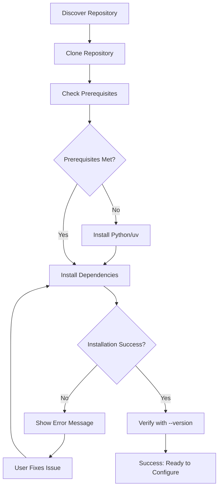
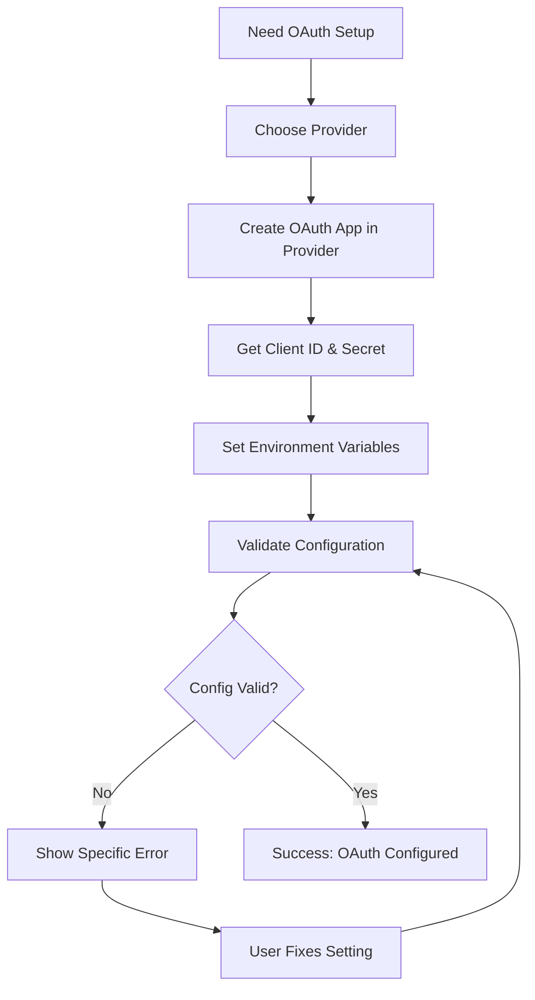
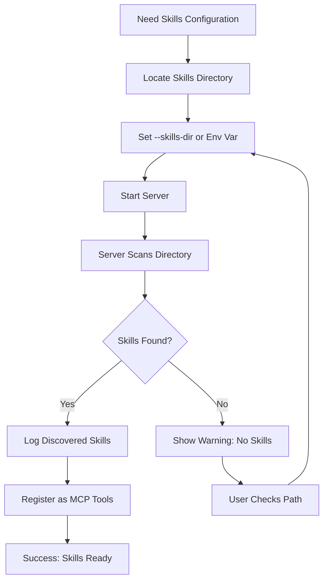
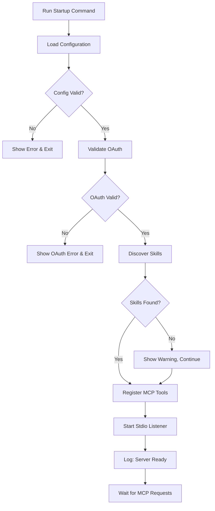
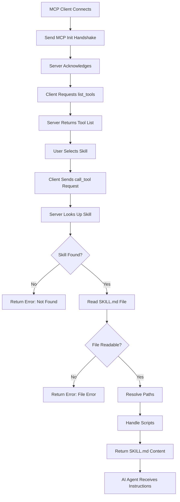
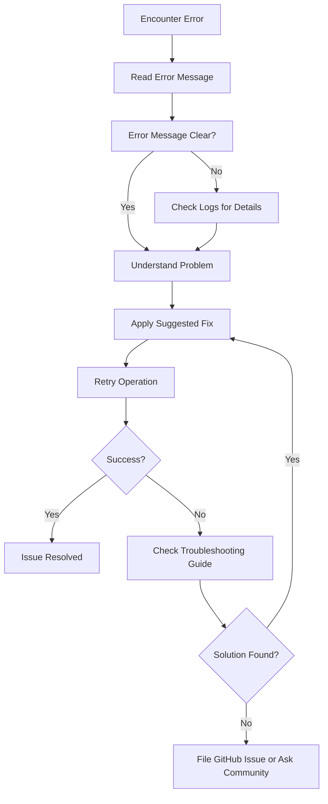
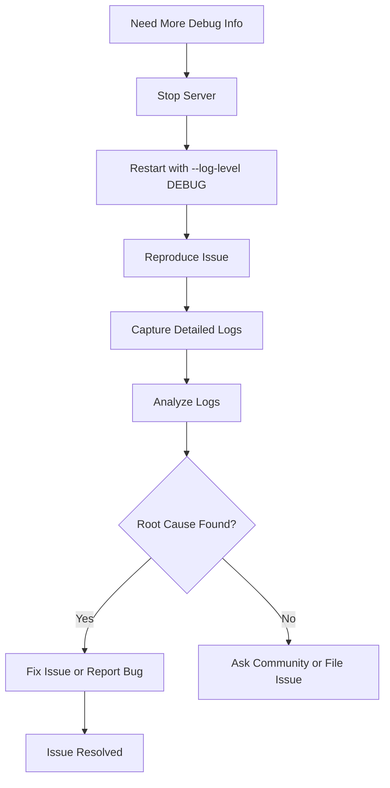
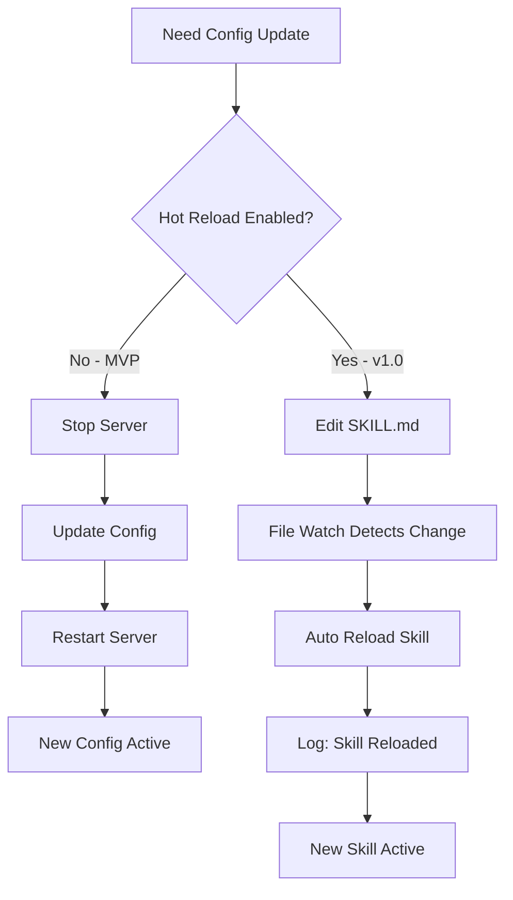

# User Flows - MCP Skills Server

## Overview

This document defines user flows for the MCP Skills Server command-line experience. All flows are from the perspective of users interacting with the CLI tool and MCP clients.

**Total Flows**: 8 critical flows documented

---

## Flow 1: Initial Setup and Installation

**Related Requirements**: FR-021 (Setup Documentation), NFR-021 (Setup Time <30 min)
**User Persona**: Maya (AI Platform Engineer)
**Goal**: Install and configure MCP Skills Server for first time

### Flow Steps

**1. Entry Point: GitHub Repository**
- User discovers repo via search or recommendation
- Reads README to understand product
- Trigger: Decides to try the product

**2. Clone Repository**
- User action: `git clone https://github.com/org/mcp-skills-server.git`
- System response: Repository cloned to local machine
- Next state: User has local copy

**3. Review Prerequisites**
- User action: Reads README prerequisites section
- System response: Shows required: Python 3.8+, uv package manager
- Next state: User verifies they have prerequisites or installs them

**4. Install Dependencies**
- User action: `uv pip install -e .` or `pip install mcp-skills-server`
- System response: Installs Python package and dependencies
- Progress indicators: Package download and installation progress
- Next state: Package installed successfully

**5. Verify Installation**
- User action: `mcp-skills-server --version`
- System response: Displays version number (e.g., "MCP Skills Server v0.1.0")
- Next state: Installation confirmed

**Success State**: Server installed and ready for configuration

**Alternative Paths**:
- If Python not installed → User installs Python first
- If uv not installed → User installs uv or uses pip
- If installation fails → Error message explains issue (permissions, network, etc.)

### Flow Diagram



**Time Estimate**: 10-15 minutes

---

## Flow 2: OAuth 2.1 Configuration

**Related Requirements**: FR-012 (OAuth Implementation), FR-013 (OAuth Configuration)
**User Persona**: Maya (AI Platform Engineer)
**Goal**: Configure OAuth 2.1 authentication with organization's provider

### Flow Steps

**1. Entry Point: After Installation**
- User has server installed
- Needs to configure OAuth for security compliance
- Trigger: Reading setup documentation

**2. Choose OAuth Provider**
- User action: Decides which OAuth provider to use (Google, GitHub, Azure, custom)
- System response: Documentation provides examples for each provider
- Next state: User knows what configuration is needed

**3. Create OAuth Application**
- User action: Creates OAuth app in provider's console (Google Cloud, GitHub Settings, Azure Portal)
- System response: Provider issues Client ID and Client Secret
- Next state: User has credentials

**4. Configure Environment Variables**
- User action: Sets environment variables or creates config file
  ```bash
  export MCP_OAUTH_CLIENT_ID="your-client-id"
  export MCP_OAUTH_CLIENT_SECRET="your-client-secret"
  export MCP_OAUTH_PROVIDER_URL="https://accounts.google.com"
  ```
- System response: Environment variables set in shell
- Next state: OAuth configured

**5. Verify OAuth Configuration**
- User action: `mcp-skills-server --validate-config`
- System response: Validates OAuth configuration, shows validation results
- Output example:
  ```
  ✓ OAuth Client ID configured
  ✓ OAuth Client Secret configured
  ✓ OAuth Provider URL configured
  ✓ OAuth configuration valid
  ```
- Next state: OAuth ready for use

**Success State**: OAuth 2.1 properly configured and validated

**Alternative Paths**:
- If OAuth app creation unclear → User consults provider-specific docs
- If credentials invalid → Error message explains which setting is wrong
- If provider URL wrong → Error message with example correct URL

### Flow Diagram



**Time Estimate**: 10-15 minutes (first time), 5 minutes (subsequent times)

---

## Flow 3: Skills Directory Configuration

**Related Requirements**: FR-004 (Skills Directory Configuration), FR-005 (Skill Discovery)
**User Persona**: Maya or James
**Goal**: Point server at dev-swarms skills directory

### Flow Steps

**1. Entry Point: OAuth Configured**
- User has OAuth configured
- Needs to tell server where skills are located
- Trigger: Following setup guide

**2. Locate Skills Directory**
- User action: Identifies where dev-swarms skills are located
- Common locations:
  - Same repo: `./dev-swarms/skills`
  - Separate repo: `/path/to/dev-swarms/skills`
  - Custom location: `/custom/path/skills`
- Next state: User knows path

**3. Configure Skills Directory**
- User action: Sets via command-line flag OR environment variable
  ```bash
  # Option 1: Command-line flag
  mcp-skills-server --skills-dir ./dev-swarms/skills

  # Option 2: Environment variable
  export MCP_SKILLS_DIR="./dev-swarms/skills"
  mcp-skills-server
  ```
- System response: Server accepts configuration
- Next state: Skills directory configured

**4. Verify Skills Discovery**
- User action: Server starts and logs discovered skills
- System response: Logs show discovered skills
- Output example:
  ```
  [INFO] Discovering skills in: ./dev-swarms/skills
  [INFO] Found 3 skills:
  [INFO]   - init-ideas (Initialize project ideas)
  [INFO]   - code-development (Feature development workflow)
  [INFO]   - draft-commit-message (Draft conventional commit messages)
  [INFO] Skill discovery complete
  ```
- Next state: Skills discovered and registered

**Success State**: Server discovers and registers skills successfully

**Alternative Paths**:
- If directory doesn't exist → Error: "Skills directory not found: /path"
- If no SKILL.md files found → Warning: "No skills found in directory"
- If SKILL.md malformed → Warning: "Skipping invalid skill: skill-name (parse error)"

### Flow Diagram



**Time Estimate**: 2-5 minutes

---

## Flow 4: Server Startup

**Related Requirements**: FR-001 (MCP Server Stdio Transport), NFR-001 (Startup Time <2s)
**User Persona**: Maya or James
**Goal**: Start MCP Skills Server successfully

### Flow Steps

**1. Entry Point: Configuration Complete**
- OAuth configured
- Skills directory configured
- Trigger: User ready to start server

**2. Start Server Command**
- User action: Runs startup command
  ```bash
  mcp-skills-server \
    --skills-dir ./dev-swarms/skills \
    --project-root . \
    --log-level INFO
  ```
- System response: Server initialization begins
- Next state: Server starting

**3. Initialization Sequence** (logged to stderr)
- System actions:
  1. Load configuration
  2. Validate OAuth settings
  3. Discover skills in directory
  4. Register MCP tools
  5. Start stdio transport listener
- Output example:
  ```
  [INFO] MCP Skills Server v0.1.0 starting...
  [INFO] Configuration loaded
  [INFO] OAuth 2.1 provider: https://accounts.google.com
  [INFO] Skills directory: ./dev-swarms/skills
  [INFO] Project root: /Users/maya/projects/dev-swarms
  [INFO] Discovering skills...
  [INFO] Found 3 skills: init-ideas, code-development, draft-commit-message
  [INFO] Registering 3 MCP tools...
  [INFO] Server ready (startup time: 1.2s)
  [INFO] Listening on stdio for MCP requests
  ```
- Next state: Server ready and waiting for MCP client

**4. Ready State**
- System state: Server running, waiting for JSON-RPC messages on stdin
- Logged: "Server ready" message
- Next state: Waiting for MCP client connection

**Success State**: Server running and ready to accept MCP requests

**Alternative Paths**:
- If config invalid → Error: "Invalid configuration: [specific issue]", server exits
- If OAuth fails → Error: "OAuth configuration invalid: [specific issue]", server exits
- If skills directory missing → Error: "Skills directory not found: [path]", server exits
- If port already in use (if using network) → Error with suggestion to check running processes

### Flow Diagram



**Time Estimate**: <2 seconds (target), confirmed by startup log

---

## Flow 5: MCP Client Connection and Skill Invocation

**Related Requirements**: FR-003 (Tool Registration), FR-007 (Skill Invocation)
**User Persona**: Maya (via MCP client)
**Goal**: Connect MCP client and invoke a skill successfully

### Flow Steps

**1. Entry Point: Server Running**
- MCP Skills Server running and ready
- User has MCP client configured (Claude Code, custom client)
- Trigger: User wants to use a skill

**2. MCP Client Connects**
- Client action: MCP client starts, connects to server via stdio
- Client sends: MCP initialization handshake (JSON-RPC)
- Server response: Acknowledges connection
- Next state: Client connected

**3. Client Requests Tool List**
- Client action: Sends `list_tools` MCP request
- Server response: Returns list of available tools (skills)
- Example response:
  ```json
  {
    "tools": [
      {
        "name": "init-ideas",
        "description": "Initialize project ideas and documentation"
      },
      {
        "name": "code-development",
        "description": "Feature-driven development workflow"
      },
      {
        "name": "draft-commit-message",
        "description": "Draft conventional commit messages"
      }
    ]
  }
  ```
- Next state: Client knows available skills

**4. Client Invokes Skill**
- Client action: User selects skill (e.g., "init-ideas"), client sends `call_tool` request
- Example request:
  ```json
  {
    "jsonrpc": "2.0",
    "method": "call_tool",
    "params": {
      "name": "init-ideas"
    },
    "id": 1
  }
  ```
- Server action:
  1. Receives request
  2. Looks up skill "init-ideas"
  3. Reads SKILL.md file
  4. Resolves file paths
  5. Handles script references
  6. Returns SKILL.md content
- Server logs (stderr):
  ```
  [INFO] Skill invoked: init-ideas
  [DEBUG] Reading SKILL.md from: ./dev-swarms/skills/dev-swarms-init-ideas/SKILL.md
  [DEBUG] Resolving file paths (project root: /Users/maya/projects/dev-swarms)
  [INFO] Skill invocation complete (response time: 45ms)
  ```
- Server response (stdout):
  ```json
  {
    "jsonrpc": "2.0",
    "result": {
      "content": "[Full SKILL.md content with resolved paths...]"
    },
    "id": 1
  }
  ```
- Next state: AI agent receives skill instructions

**5. AI Agent Uses Skill**
- AI agent receives SKILL.md content
- Agent follows instructions in skill
- User sees AI agent performing skill tasks

**Success State**: Skill successfully invoked, AI agent has instructions

**Alternative Paths**:
- If skill not found → Server returns error: "Tool not found: skill-name"
- If SKILL.md file missing → Server returns error: "Skill file not found"
- If file read error → Server returns error with details
- If path resolution fails → Server logs warning, returns content with original paths

### Flow Diagram



**Time Estimate**: <100ms per invocation (target)

---

## Flow 6: Error Troubleshooting

**Related Requirements**: FR-017 (Error Classification), FR-018 (Actionable Error Messages)
**User Persona**: Maya or James
**Goal**: Diagnose and fix an issue with the server

### Flow Steps

**1. Entry Point: Something Wrong**
- User encounters an error
- Server not starting, skill not working, etc.
- Trigger: Error message or unexpected behavior

**2. Read Error Message**
- System displays error message
- Error includes:
  - Error code (e.g., `ERR_OAUTH_001`)
  - Clear description of problem
  - Suggested fix
  - Link to troubleshooting docs (optional)
- Example:
  ```
  [ERROR] ERR_OAUTH_001: OAuth Client ID not configured

  The OAuth client ID is required for authentication.

  To fix this issue:
  1. Set the MCP_OAUTH_CLIENT_ID environment variable:
     export MCP_OAUTH_CLIENT_ID="your-client-id"

  2. Or pass it via command-line flag:
     --oauth-client-id "your-client-id"

  For help setting up OAuth, see:
  https://docs.example.com/oauth-setup
  ```
- Next state: User understands problem

**3. Check Logs for Details**
- User action: Reviews stderr logs for more context
- System provides: Detailed log messages with DEBUG level
- Logs include:
  - Timestamp
  - Log level
  - Component
  - Message
  - Context (file paths, values, etc.)
- Example:
  ```
  [2025-12-26 16:30:45] [ERROR] [config] OAuth Client ID not configured
  [2025-12-26 16:30:45] [DEBUG] [config] Checked environment variable: MCP_OAUTH_CLIENT_ID (not set)
  [2025-12-26 16:30:45] [DEBUG] [config] Checked command-line flag: --oauth-client-id (not provided)
  [2025-12-26 16:30:45] [ERROR] [server] Server startup failed due to configuration errors
  ```
- Next state: User has full context

**4. Apply Suggested Fix**
- User action: Follows suggestion from error message
- Example: Sets missing environment variable
- Next state: Issue resolved (hopefully)

**5. Retry Operation**
- User action: Restarts server or retries operation
- System response: Either succeeds or shows different error
- Next state: Success or new error to troubleshoot

**Success State**: Issue identified and resolved

**Alternative Paths**:
- If fix doesn't work → User consults troubleshooting guide
- If issue persists → User files GitHub issue with logs
- If complex issue → User joins Discord/Slack for community help

### Flow Diagram



**Time Estimate**: 5-15 minutes (depends on complexity)

---

## Flow 7: Increasing Log Verbosity for Debugging

**Related Requirements**: FR-016 (Logging Infrastructure), NFR-026 (Logging for Debugging)
**User Persona**: Maya (troubleshooting integration)
**Goal**: Get detailed logs to debug an issue

### Flow Steps

**1. Entry Point: Need More Details**
- User experiencing issue but error messages not detailed enough
- Trigger: Wants to see what's happening internally

**2. Stop Server**
- User action: Stops running server (Ctrl+C or kill process)
- System response: Server shuts down gracefully
- Next state: Server stopped

**3. Restart with DEBUG Logging**
- User action: Restarts server with `--log-level DEBUG`
  ```bash
  mcp-skills-server \
    --skills-dir ./dev-swarms/skills \
    --log-level DEBUG
  ```
- System response: Server starts with verbose logging
- Next state: Debug logging enabled

**4. Reproduce Issue**
- User action: Performs action that caused issue
- System response: Logs every step in detail
- Example DEBUG output:
  ```
  [DEBUG] Received JSON-RPC request: {"jsonrpc": "2.0", "method": "call_tool", ...}
  [DEBUG] Parsed method: call_tool
  [DEBUG] Tool name: init-ideas
  [DEBUG] Looking up tool in registry...
  [DEBUG] Tool found: init-ideas -> ./dev-swarms/skills/dev-swarms-init-ideas
  [DEBUG] Reading SKILL.md file: ./dev-swarms/skills/dev-swarms-init-ideas/SKILL.md
  [DEBUG] File size: 12,543 bytes
  [DEBUG] Parsing YAML frontmatter...
  [DEBUG] Frontmatter parsed: {name: "init-ideas", description: "..."}
  [DEBUG] Resolving file paths...
  [DEBUG] Found 3 file references to resolve
  [DEBUG] Resolved: 00-init-ideas/README.md -> /Users/maya/projects/dev-swarms/00-init-ideas/README.md
  [DEBUG] Response time: 47ms
  [INFO] Skill invocation complete: init-ideas
  ```
- Next state: Detailed logs captured

**5. Analyze Logs**
- User action: Reviews DEBUG logs to identify root cause
- User finds: Specific step where error occurs or unexpected behavior
- Next state: Root cause identified

**6. Fix Issue or Report Bug**
- User action: Either fixes configuration or reports bug with logs
- Next state: Issue resolved or reported

**Success State**: Root cause identified through detailed logging

### Flow Diagram



**Time Estimate**: 10-20 minutes

---

## Flow 8: Updating Configuration Without Restart

**Related Requirements**: FR-015 (Server Configuration), P1: FR-027 (Skill Hot Reload)
**User Persona**: Maya (iterating on skill development)
**Goal**: Change configuration or update skills without full restart

### Flow Steps (MVP - Requires Restart)

**1. Entry Point: Need Configuration Change**
- User wants to change OAuth provider, skills directory, or other setting
- Trigger: Configuration needs updating

**2. Stop Server**
- User action: Stops server (Ctrl+C)
- System response: Graceful shutdown
- Next state: Server stopped

**3. Update Configuration**
- User action: Changes environment variables or command-line flags
- Example:
  ```bash
  export MCP_OAUTH_PROVIDER_URL="https://github.com/login/oauth"
  ```
- Next state: Configuration updated

**4. Restart Server**
- User action: Starts server again with new configuration
- System response: Loads new configuration on startup
- Next state: Server running with new config

**Success State**: Configuration updated and active

### Flow Steps (v1.0 - Hot Reload for Skills)

**1. Entry Point: SKILL.md Updated**
- User edits SKILL.md file
- Hot reload enabled (P1 feature)
- Trigger: File system watch detects change

**2. Automatic Reload**
- System action: Detects SKILL.md file change
- System response:
  ```
  [INFO] Detected change: dev-swarms-init-ideas/SKILL.md
  [INFO] Reloading skill: init-ideas
  [DEBUG] Re-parsing SKILL.md...
  [DEBUG] Updating tool registry...
  [INFO] Skill reloaded successfully: init-ideas
  ```
- Next state: Updated skill available immediately

**3. No Restart Needed**
- User action: None (automatic)
- System state: New skill version active
- Next state: Next invocation uses updated skill

**Success State**: Skill updated without server restart

### Flow Diagram



**Time Estimate**: 1-2 minutes (restart), instant (hot reload)

---

## User Flow Summary

| Flow | Time Estimate | Frequency | Priority |
|------|--------------|-----------|----------|
| Initial Setup and Installation | 10-15 min | Once per user | P0 |
| OAuth Configuration | 10-15 min | Once per user | P0 |
| Skills Directory Configuration | 2-5 min | Once per user | P0 |
| Server Startup | <2 sec | Every session | P0 |
| Skill Invocation | <100ms | Very frequent | P0 |
| Error Troubleshooting | 5-15 min | Occasional | P0 |
| Debug Logging | 10-20 min | Occasional | P0 |
| Configuration Update | 1-2 min | Occasional | P1 |

**Total Setup Time (First Use)**: ~25-35 minutes
**Target**: <30 minutes (per NFR-021)

---

Last updated: 2025-12-26
