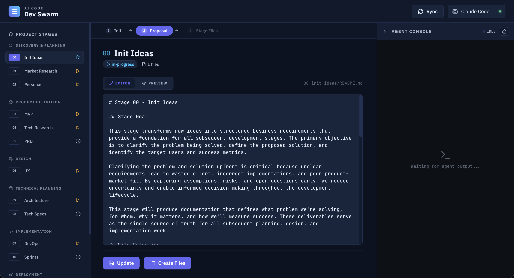

## 🤖 What is AI Dev Swarm?

AI Dev Swarm is an AI-powered development framework designed to turn a simple idea into a full-stack, commercial-ready product — automatically.

No coding knowledge required.
No tech background needed.
Just an idea.

AI Dev Swarm guides you step by step through the entire product lifecycle.

AI handles everything.
You focus on vision and decisions.

Our goal is simple but ambitious:

Enable a one-person company to become real — powered by AI.

## Support

Discord support: https://juniorit.ai/virtual-office

## How It Works

Fork and clone this project, then work with AI Code Agent below by default via Agent Skills integration.

- `Claude Code`
- `OpenAI Codex`
- `Gemini CLI`: npm install -g @google/gemini-cli@preview (enable in settings)
- `GitHub Copilot CLI`
- `opencode`

For other AI Agents that do not support Agent skills natively, you can use them as an MCP server by configuring:

```json
{
  "mcpServers": {
    "skillz": {
      "command": "uvx",
      "args": [
        "skillz@latest",
        "/project-root-absolute-path/dev-swarm/skills",
        "--verbose"
      ]
    }
  }
}
```

### Web UI (Optional)



A visual web interface is available as an alternative to the command-line workflow.

```bash
./webui.sh
```

This launches the WebUI at **http://localhost:3001** (localhost only). It auto-installs dependencies and builds on first run.

> **Note:** AI agent execution is disabled by default. To enable it, set `WEBUI_AGENT_EXECUTE=true` in `dev-swarm/.env`. Only enable this on a dedicated machine or inside a Docker container.

See [dev-swarm/webui/README.md](dev-swarm/webui/README.md) for details.

📖 **New to AI Dev Swarm?** Check out the [Complete User Manual](USER-MANUAL.md) for a step-by-step guide designed for non-technical users.

Start with your ideas in `ideas.md`, then progress through structured stages:

**Planning & Strategy (Stages 0-5)**
- **Stage 0: Init Ideas** - Transform informal ideas into professional project documentation
- **Stage 1: Market Research** - Validate the problem and analyze competitive landscape
- **Stage 2: Personas** - Define user personas and prioritized user stories (P0/P1/P2)
- **Stage 3: MVP** - Define minimum viable product scope and success metrics
- **Stage 4: Tech Research** - Validate technical feasibility with PoCs and technology spikes (optional)
- **Stage 5: PRD** - Create comprehensive product requirements document

### Design & Architecture (Stages 6-8)
- **Stage 6: UX Design** - Design user flows, interactions, and mockups
- **Stage 7: Architecture** - Define system components, data flow, and deployment boundaries
- **Stage 8: Tech Specs** - Specify tech stack, security, coding standards, and theme guidelines

### Development & Deployment (Stages 9-11)
- **Stage 9: DevOps** - Setup development environment, GitHub, MCP tools, and Docker
- **Stage 10: Sprints** - AI-accelerated feature development with backlogs and testing
- **Stage 11: Deployment** - Deploy to staging/production with CI/CD pipelines

## Key Features (Planned)

- **MCP Protocol Integration**: Standard stdio transport for maximum compatibility
- **Automatic Skill Discovery**: Dynamically discovers and registers all dev-swarm skills
- **Context Injection**: Injects skill instructions into AI agent sessions
- **Smart Path Resolution**: Handles file paths relative to project root
- **Python + FastMCP**: Modern, reliable implementation with uv for dependency management

## Getting Started

**For Beginners:**
1. Read the [Complete User Manual](USER-MANUAL.md) - designed for non-technical users
2. Write your ideas in `ideas.md`
3. Use `/stage 0` command to start your AI-powered development journey

**For Experienced Users:**
1. Review the initial project documentation in `00-init-ideas/`
2. Follow the dev-swarm methodology through each stage
3. Use AI agents to accelerate development and maintain quality

## Skills Available

This project uses the dev-swarm framework skills:
- **init-ideas** - Project kickoff and idea formalization
- **market-research** - Market validation and competitive analysis
- **personas** - User personas and story creation
- **mvp** - MVP scope definition
- **tech-research** - Technical feasibility validation (PoCs, spikes)
- **prd** - Product requirements documentation
- **ux** - User experience design
- **architecture** - System architecture design
- **tech-specs** - Technical specifications
- **devops** - Development environment setup
- **sprints** - Sprint and backlog management
- **code-development** - Feature implementation
- **code-review** - Code quality review
- **code-test** - Comprehensive testing
- **deployment** - Production deployment
- **draft-commit-message** - Generate conventional commits

## Documentation

- **[User Manual](USER-MANUAL.md)** - Complete beginner-friendly guide covering all stages, workflows, and examples
- **Repository Structure** - See `dev-swarm/docs/repository-structure.md` for folder organization
- **Stage Documentation** - Organized in numbered folders (00-11) representing each development stage
- **Knowledge Base** - Feature documentation in `features/` for AI reference
- **Archive** - Completed work in `99-archive/`

## 🤝 Want to Contribute?

If you’re interested in contributing:

No prior experience required.
No coding skills required.
Just curiosity and willingness to learn.

Once you show interest, I’ll personally guide you on how to contribute.

## ⭐ Call to Action

🙏 Please:

⭐ Star the repo.
🍴 Fork the project.
💬 Share feedback.
🤝 Join us as a contributor.

Let’s redefine how products are built in the AI era.

One idea. One person. One AI swarm. 🚀

Join our Discord server for discussion: https://juniorit.ai/virtual-office

## License

This project is licensed under the GNU Affero General Public License v3.0 - see the [LICENSE](LICENSE) file for details.

This project may include open source code with other licenses. These codes will keep their original licenses.
