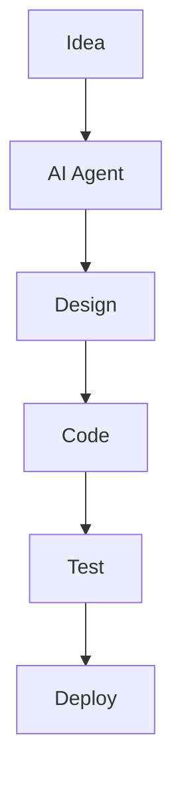

This skill is for creating Mermaid images.

Node.js and pnpm must be installed first.

Verify `mmdc` availability or use `pnpm dlx`:
`pnpm dlx @mermaid-js/mermaid-cli --version`

Example diagram file: `diagram.mmd`

Generate SVG:
`pnpm dlx @mermaid-js/mermaid-cli -i diagram.mmd -o diagram.svg`
