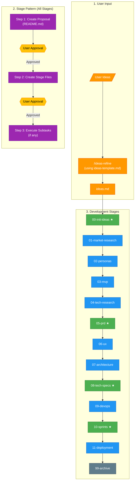
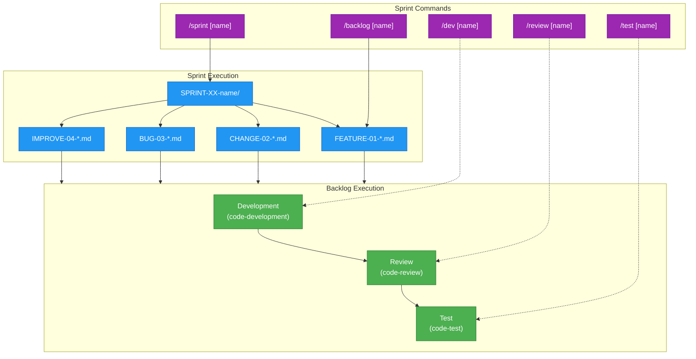

# Dev-Swarm Development Workflow

This diagram illustrates the complete AI-driven software development workflow from initial idea to project archive.

## Overview

The dev-swarm system guides projects through structured development stages:

1. **User Input** → `/ideas-refine` (using template) → `ideas.md`
2. **Each Stage** follows a two-step pattern:
   - Step 1: Create proposal (README.md)
   - Step 2: Create stage files after user approval
   - Some stages have special subtasks (tech research, UI mockups, etc.)

## Main Workflow Diagram

## Stage Subtasks Diagram

```mermaid
flowchart LR
    subgraph S04_SUB["04-tech-research Subtasks"]
        direction TB
        S04_PROP["1. Approve Stage Proposal"]
        S04_README["2. Create ALL Research READMEs"]
        S04_APR{{"User Approval<br/>(All READMEs)"}}

        subgraph TOPIC_LOOP["3. For Each Research Topic"]
            direction TB
            T_EXEC["Execute Research"]
            T_CODE["Write PoC Code"]
            T_TEST["Write Tests"]
            T_RES["Document Results"]
            T_NEXT["Next Topic"]

            T_EXEC --> T_CODE
            T_CODE --> T_TEST
            T_TEST --> T_RES
            T_RES --> T_NEXT
        end

        S04_PROP --> S04_README
        S04_README --> S04_APR
        S04_APR -->|Approved| TOPIC_LOOP
    end

    subgraph S06_SUB["06-ux Subtasks"]
        direction TB
        S06_PROP["1. Approve Stage Proposal"]
        S06_FILES["2. Create Stage Files<br/>(incl. mockup/README.md)"]
        S06_APR{{"User Approval"}}
        S06_CHECK{"Has design-ui-mockup/?"}

        subgraph MOCKUP_FLOW["3. Create Mockup Files"]
            direction TB
            M_FILES["Create HTML/CSS/JS"]
            M_CSS["styles.css"]
            M_NAV["navigation.js"]
            M_PAGES["page1.html, page2.html, ..."]

            M_FILES --> M_CSS
            M_FILES --> M_NAV
            M_FILES --> M_PAGES
        end

        S06_PROP --> S06_FILES
        S06_FILES --> S06_APR
        S06_APR -->|Approved| S06_CHECK
        S06_CHECK -->|Yes| MOCKUP_FLOW
        S06_CHECK -->|No| S06_DONE["Done"]
    end

    subgraph S09_SUB["09-devops Subtasks"]
        direction TB
        S09_PROP["1. Create Proposal<br/>(README.md)"]
        S09_FILES["2. Create Stage Files"]
        S09_EXEC["3. Execute Tasks<br/>(if any)"]
        S09_PROP --> S09_FILES --> S09_EXEC
    end

    subgraph S10_SUB["10-sprints Subtasks"]
        direction TB
        PLAN["Create Development Plan"]
        SPRINT["Create Sprint Folders"]

        subgraph BACKLOG["Each Backlog"]
            direction LR
            DEV["/dev"]
            REV["/review"]
            TST["/test"]
            DEV --> REV --> TST
        end

        PLAN --> SPRINT
        SPRINT --> BACKLOG
    end

    subgraph S11_SUB["11-deployment Subtasks"]
        direction TB
        S11_PROP["1. Create Proposal<br/>(README.md)"]
        S11_FILES["2. Create Stage Files"]
        S11_EXEC["3. Execute Tasks<br/>(if any)"]
        S11_PROP --> S11_FILES --> S11_EXEC
    end

    subgraph S99_SUB["99-archive / restore"]
        direction TB
        ARCH["Archive Project"]
        RST["Restore Project"]
    end

    %% Styling
    classDef approval fill:#FFC107,stroke:#FF8F00,color:#000
    classDef decision fill:#9C27B0,stroke:#6A1B9A,color:#fff

    class S04_APR,S06_APR approval
    class S06_CHECK decision
```

## Sprint Workflow Detail

## Stage Details

| Stage | Name | Required | Special Subtasks |
|-------|------|----------|------------------|
| 00 | init-ideas | ★ Yes | - |
| 01 | market-research | No | Web research, competitor analysis |
| 02 | personas | No | - |
| 03 | mvp | No | Feature prioritization (MoSCoW, RICE) |
| 04 | tech-research | No | Create ALL research READMEs → approval → execute each topic (PoC code + tests + results) |
| 05 | prd | ★ Yes | - |
| 06 | ux | No | Create stage files (incl. mockup/README.md) → approval → create mockup files |
| 07 | architecture | No | Create diagrams (C4, data flow, etc.) |
| 08 | tech-specs | ★ Yes | - |
| 09 | devops | No | Proposal → files → execute tasks (if any) |
| 10 | sprints | ★ Yes | Create sprints, run dev/review/test |
| 11 | deployment | No | Proposal → files → execute tasks (if any) |
| 99 | archive | - | Single action (archive or restore) |

## Commands Reference

| Command | Description |
|---------|-------------|
| `/ideas-refine` | Refine ideas.md using ideas-template.md |
| `/stage [n]` | Start stage n (0-11, 99) |
| `/skip [n]` | Skip stage n by creating SKIP.md |
| `/sprint [name]` | Process all backlogs in a sprint |
| `/backlog [name]` | Process single backlog (dev + review + test) |
| `/dev [name]` | Development phase only |
| `/review [name]` | Review phase only |
| `/test [name]` | Test phase only |
| `/stage restore [name]` | Restore project from 99-archive |

## Legend

- **★ Green (Required)**: Non-skippable stages (00, 05, 08, 10)
- **Blue (Skippable)**: Optional stages (create SKIP.md to skip)
- **Orange (Input)**: User input and ideas refinement
- **Purple (Commands)**: Slash commands
- **Yellow (Approval)**: User approval checkpoints
- **Gray (Archive)**: Archive and restore operations
